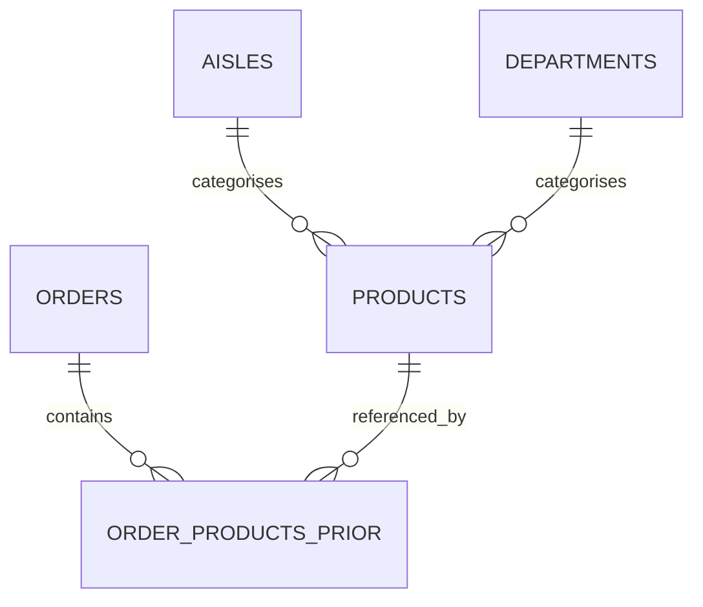

# Data Report

This report documents the data used in the project. It covers the raw datasets, the processing steps that produce the working data, and the exploratory analysis that informs the visualisations. The goal is to make the data side of the project traceable and reproducible for anyone joining later.

## Raw data

### Overview Raw Datasets

: Overview of raw datasets used in the project. {#tbl-raw-overview}

| Name | Source | Storage location |
|---|---|---|
| Instacart Online Grocery Dataset 2017 | Kaggle, published by Instacart | `data/` folder in the repository (CSV files, not committed) |

### Details: Instacart Online Grocery Dataset (2017)

#### Description of content

The dataset contains anonymised order data from Instacart, an online grocery delivery service in the United States. It covers more than 3.4 million orders placed by around 206,000 customers, and includes 49,688 unique products organised into 134 aisles and 21 departments. The full purchase history adds up to roughly 32 million product level entries.

For each order the dataset records the day of week, the hour of day, the time since the previous order, the products bought, the position of each product in the basket, and whether the product had been ordered by the same customer before.

#### Data source and provider

The dataset was published on Kaggle by Instacart as part of a public competition and is widely used for research and educational purposes. The data is fully anonymised: customers and products only appear as numeric IDs, and no names, addresses, payment details or other personal information are included.

#### Data procurement

The raw CSV files are downloaded from Kaggle and placed in the `data/` folder of the repository. New team members can either download the files directly from Kaggle or run `data_acquisition/data_acquisition.ipynb`, which documents the expected file names and locations.

#### Legal aspects and licensing

The data is published under Kaggle's terms of service and Instacart's data usage rules. It may be used for research and educational work, but it must not be redistributed or used commercially. Anyone working with the repository is expected to follow Instacart's terms at https://www.instacart.com/legal/terms and Kaggle's dataset rules.

#### Data governance

The dataset is classified as public, fully anonymised and non personal. It contains no business confidential information from Instacart and no personally identifiable information from customers. No additional access controls or anonymisation steps are required on top of what Instacart already applied.

#### Variable categorisation

The variables used in the analysis fall into the following groups:

* Dimensional variables for grouping and filtering: user ID, product ID, aisle, department, day of week, hour of day.
* Measure variables for counting and aggregation: order counts per user or product, number of items per order, co-occurrence counts between products.
* Target variable for loyalty analysis: the reorder rate per product, derived from the binary `reordered` column.
* Explanatory variables: product attributes (department, aisle) and temporal attributes (day of week, hour of day).

#### Entity Relationship Diagram



The diagram shows the relational structure of the raw data. `orders.csv` is the order header table. `order_products__prior.csv` is the line item table linking orders and products. `products.csv` is the product master table, with `aisles.csv` and `departments.csv` providing the readable category labels.

#### Data Catalogue

: Data catalogue for the raw Instacart files. {#tbl-data-catalogue}

| Column | Source file | Datatype | Range or validation | Short description |
|---|---|---|---|---|
| `order_id` | `orders.csv` | integer | unique per row | Identifier for one customer order. |
| `user_id` | `orders.csv` | integer | not null | Anonymised customer identifier. |
| `order_number` | `orders.csv` | integer | >= 1 | Sequence number of the order for that user. |
| `order_dow` | `orders.csv` | integer | 0 to 6 | Day of week of the order. |
| `order_hour_of_day` | `orders.csv` | integer | 0 to 23 | Hour of the order on a 24 hour scale. |
| `days_since_prior_order` | `orders.csv` | float | 0 to 30, null for first order | Days between this order and the previous one for the same user. |
| `order_id` | `order_products__prior.csv` | integer | foreign key to `orders.csv` | Order to which the line item belongs. |
| `product_id` | `order_products__prior.csv` | integer | foreign key to `products.csv` | Product purchased in that order. |
| `add_to_cart_order` | `order_products__prior.csv` | integer | >= 1 | Position of the product in the basket. |
| `reordered` | `order_products__prior.csv` | integer | 0 or 1 | 1 if the user has ordered this product before, otherwise 0. |
| `product_id` | `products.csv` | integer | unique per row | Product identifier. |
| `product_name` | `products.csv` | string | not null | Human readable product name. |
| `aisle_id` | `products.csv` | integer | foreign key to `aisles.csv` | Aisle the product belongs to. |
| `department_id` | `products.csv` | integer | foreign key to `departments.csv` | Department the product belongs to. |
| `aisle_id` | `aisles.csv` | integer | unique per row | Aisle identifier. |
| `aisle` | `aisles.csv` | string | not null | Aisle label, for example "fresh vegetables". |
| `department_id` | `departments.csv` | integer | unique per row | Department identifier. |
| `department` | `departments.csv` | string | not null | Department label, for example "produce". |

#### Data characteristics and quality

The exploratory analysis is implemented in `eda/01_eda.ipynb`. The most relevant findings are summarised below.

**Completeness.** The only missing values in the raw data appear in `days_since_prior_order`. The number of missing entries (206,209) matches the number of unique users in the dataset, which confirms that the missing values are not a quality defect but an expected artefact of the first order per user. All other columns are complete.

**Univariate summaries.** Numerical variables are profiled with the standard summary statistics from the template (mean, median, quantiles, range, standard deviation). The summary is produced directly from the raw files:

```{python}
#| label: tbl-univariate
#| tbl-cap: "Univariate summary statistics for key numerical variables."
#| echo: true
#| code-fold: true
from pathlib import Path
import pandas as pd

data_dir = Path().resolve().parent / "data"

orders = pd.read_csv(data_dir / "orders.csv")
order_products = pd.read_csv(data_dir / "order_products__prior.csv")

summary = pd.DataFrame(
    {
        "add_to_cart_order": order_products["add_to_cart_order"],
        "days_since_prior_order": orders["days_since_prior_order"],
        "order_hour_of_day": orders["order_hour_of_day"],
    }
).describe()

summary
```

The variables behave as expected. `add_to_cart_order` is right skewed because most baskets contain a small number of items but a few baskets are very large. `days_since_prior_order` is bounded at 30 by the way Instacart records the value. `order_hour_of_day` shows the daily shopping rhythm and is the basis for the heatmap in @fig-shopping-heatmap.

**Categorical variables.** The categorical variables (`department`, `aisle`) have a small and fixed number of classes (21 departments, 134 aisles). The distribution is heavily skewed: a few departments such as Produce and Dairy & Eggs account for most of the purchase volume, while Bulk, Other and Alcohol contribute very little.

**Reorder behaviour.** The overall reorder rate sits at around 58 per cent. Products with reorder rates above 0.8 are everyday staples such as milk, water and bananas. This pattern is the main signal used in the loyalty view of the dashboard.

**Co-purchase patterns.** Classical correlation measures (Pearson, Spearman, Kendall) are not very informative for this dataset, since the analysis works with categorical product IDs rather than numerical features. The equivalent role is played by co-occurrence counts and lift values between product pairs, which are computed in the processed data layer described below. The strongest co-occurrence at department level is Dairy & Eggs with Produce, which appears in roughly 1.8 million orders.

**Temporal patterns.** Most orders are placed on Sundays and Mondays between 09:00 and 15:00, with very low activity before 06:00 and after 22:00. The heatmap in @fig-shopping-heatmap visualises this rhythm.

**Limitations.** The dataset has no absolute calendar dates, only day of week and hour of day, so no calendar based trend analysis is possible. The data also reflects U.S. shopping behaviour from 2017 and is not necessarily representative of current or European customers.

## Processed data

### Overview Processed Datasets

: Overview of processed datasets used in the project. {#tbl-processed-overview}

| Name | Source | Storage location |
|---|---|---|
| Merged product master table (`products_full`) | `products.csv` merged with `aisles.csv` and `departments.csv` | Created in memory in `deployment/app.py` and `eda/*.ipynb` |
| Product co-purchase network data | Computed from `order_products__prior.csv` | `data/data.parquet`, `data/ranking.parquet`, `data/pairs.parquet` |

### Details: Merged Product Master Table

#### Description

The merged product table combines the product master data with readable aisle and department labels. It is the basis for every view in the dashboard that shows products by category, since the raw `products.csv` only contains numeric foreign keys.

#### Processing steps

1. Load `products.csv`, `aisles.csv` and `departments.csv`.
2. Merge `products.csv` with `aisles.csv` on `aisle_id`.
3. Merge the result with `departments.csv` on `department_id`.
4. Keep the result as `products_full` in memory.

The merge is cheap and deterministic, so the table is rebuilt at runtime rather than persisted to disk.

#### How to access

```python
products_full = (
    products
    .merge(aisles, on="aisle_id")
    .merge(departments, on="department_id")
)
```

#### Data Catalogue

| Column | Datatype | Range or validation | Short description |
|---|---|---|---|
| `product_id` | integer | unique per row | Product identifier. |
| `product_name` | string | not null | Human readable product name. |
| `aisle_id` | integer | foreign key | Aisle the product belongs to. |
| `aisle` | string | not null | Aisle label. |
| `department_id` | integer | foreign key | Department the product belongs to. |
| `department` | string | not null | Department label. |

### Details: Product Co-Purchase Network Data

#### Description

The co-purchase network represents how often pairs of products appear in the same order. It is the basis for the "Products Bought Together" view in the dashboard. The network is precomputed because running the pair counting on the full 32 million row table at request time would make the dashboard unusable.

#### Processing steps

1. Read `order_products__prior.csv` and group by `order_id` to get the basket per order.
2. Generate all product pairs within each basket.
3. Count how often each pair occurs across all baskets.
4. Filter to pairs above a minimum co-occurrence threshold to remove noise.
5. Compute lift values for each remaining pair.
6. Build a ranking of products by purchase frequency for layout and filtering.
7. Store the results as Parquet files so they can be reloaded without recomputing.

The notebook `evaluation/graph_plot.ipynb` together with `eda/defs_graph_plot.py` runs these steps and writes the three output files.

#### How to access

```python
import sys
sys.path.append("eda")
from defs_graph_plot import load_processed

# data and ranking are DataFrames; pairs is a Counter of {(product_a, product_b): count}
data, ranking, pairs = load_processed(out_dir="data")
```

The dashboard exposes sliders that let the user filter the network at view time: top N products by frequency (50 to 500), minimum co-purchase count (10 to 200), and minimum lift threshold (1.0 to 5.0).

#### Catalogue of Processed Files

| File | Generated by | Loaded by | Content |
|---|---|---|---|
| `data/data.parquet` | `evaluation/graph_plot.ipynb`, `eda/defs_graph_plot.py` | `evaluation/graph_plot.ipynb` | Merged line-item table (`order_products__prior.csv` joined with `products.csv`); the basis for the ranking and the pair counting. |
| `data/ranking.parquet` | `evaluation/graph_plot.ipynb`, `eda/defs_graph_plot.py` | `evaluation/graph_plot.ipynb` | Product ranking by purchase frequency (absolute count and share in %). |
| `data/pairs.parquet` | `evaluation/graph_plot.ipynb`, `eda/defs_graph_plot.py` | `evaluation/graph_plot.ipynb` | Co-occurrence counts for every product pair that appears together in an order. Lift values are computed at runtime, not stored. |

## Order frequency heatmap

The following figure reproduces the shopping time analysis from `eda/01_eda.ipynb` and `deployment/app.py`. It is one of the most informative views of the raw data, since it shows the only temporal pattern that the dataset actually allows.

```{python}
#| label: fig-shopping-heatmap
#| fig-cap: "Order frequency by day of week and hour of day."
#| echo: true
#| code-fold: true
from pathlib import Path
import pandas as pd
import matplotlib.pyplot as plt
import seaborn as sns

data_dir = Path().resolve().parent / "data"

orders = pd.read_csv(data_dir / "orders.csv")

heatmap_data = (
    orders.groupby(["order_dow", "order_hour_of_day"])["order_id"]
    .count()
    .unstack()
)

heatmap_data.index = [
    "Sunday",
    "Monday",
    "Tuesday",
    "Wednesday",
    "Thursday",
    "Friday",
    "Saturday",
]

fig, ax = plt.subplots(figsize=(12, 4))
sns.heatmap(
    heatmap_data,
    cmap="YlOrRd",
    ax=ax,
    linewidths=0.4,
    linecolor="white",
    cbar_kws={"label": "Number of orders"},
)
ax.set_title("Order frequency by day and hour", fontsize=14, fontweight="bold", pad=12)
ax.set_xlabel("Hour of day")
ax.set_ylabel("")
plt.tight_layout()
plt.show()
```

@fig-shopping-heatmap confirms the pattern described above: orders cluster on Sunday and Monday between roughly 09:00 and 15:00, and activity drops off sharply in the evening. The dashboard uses the same logic to build its shopping time view, which means the heatmap above also acts as a sanity check on the live application.

## Summary

The project uses the Instacart 2017 dataset as its only source of data. The raw files are clean and well documented, with the only missing values being the expected ones for each user's first order. The processing layer adds readable category labels to the products and precomputes the co-purchase network, which together cover every analysis shown in the dashboard. The data is sufficient for the visualisation goals of the project, with the understanding that all results are bound to U.S. shopping behaviour in 2017 and to within-week temporal patterns.