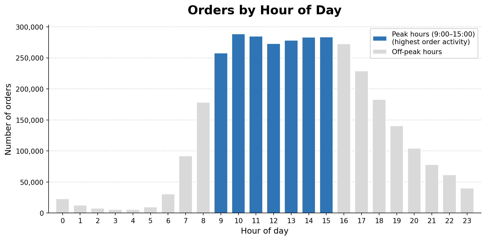
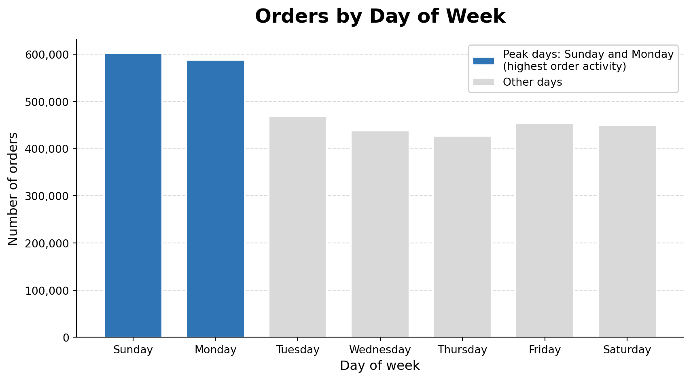
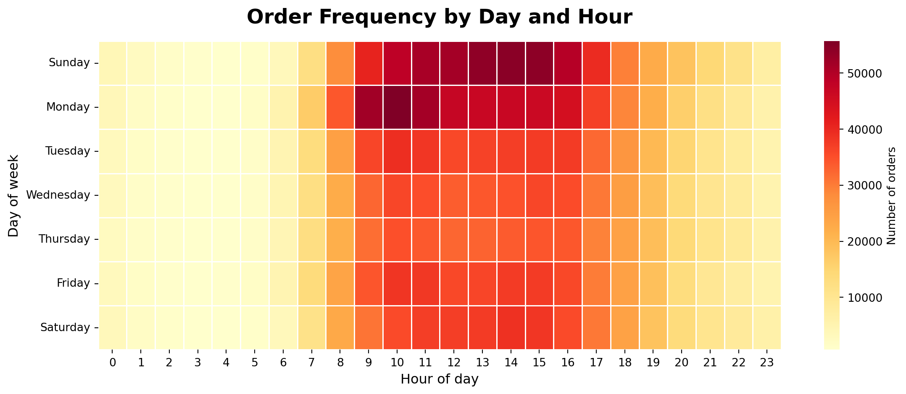

# Data Report

All information on the data used in this project is compiled in the data report to ensure traceability and reproducibility of the results.

During exploratory data analysis, data quality issues and structural characteristics are identified, which may require preprocessing, merging of datasets and feature engineering. The processed data described in this report serves as the foundation for the subsequent visualisation design and implementation.

## Raw data
### Overview Raw Datasets

### Overview Raw Datasets

: Overview of raw datasets used in the project. {#tbl-raw-overview}

| Name | Source | Storage location |
|---|---|---|
| orders.csv | Instacart Online Grocery Shopping Dataset 2017 | `data/orders.csv` |
| products.csv | Instacart Online Grocery Shopping Dataset 2017 | `data/products.csv` |
| aisles.csv | Instacart Online Grocery Shopping Dataset 2017 | `data/aisles.csv` |
| departments.csv | Instacart Online Grocery Shopping Dataset 2017 | `data/departments.csv` |
| order_products__prior.csv | Instacart Online Grocery Shopping Dataset 2017 | `data/order_products__prior.csv` |

### Details Instacart Dataset

The project uses the Instacart Online Grocery Shopping Dataset from 2017. The dataset contains anonymised grocery orders from online customers and includes information about orders, products, aisles, departments and previously purchased products.

The dataset is used to analyse product popularity, purchasing behaviour over time, co-purchase patterns and reorder behaviour. Since the project focuses on a data visualisation product rather than a prediction model, the analysis mainly uses `order_products__prior.csv`, which contains the historical order-product relationships.

The dataset is stored locally in the `data` folder of the project repository.

#### Data Catalogue

: Simplified data catalogue of the main raw datasets. {#tbl-data-catalogue}

| Dataset | Important columns | Short description |
|---|---|---|
| orders | `order_id`, `user_id`, `order_dow`, `order_hour_of_day`, `days_since_prior_order` | Contains order-level information and time-related variables. |
| products | `product_id`, `product_name`, `aisle_id`, `department_id` | Contains product names and category references. |
| aisles | `aisle_id`, `aisle` | Contains aisle names. |
| departments | `department_id`, `department` | Contains department names. |
| order_products__prior | `order_id`, `product_id`, `add_to_cart_order`, `reordered` | Contains historical product purchases per order. |

#### Entity Relationship Diagram

The relationships between the datasets are straightforward and are described in the data preparation section. Therefore, no separate entity relationship diagram is included.

#### Data Characteristics and Quality

The dataset contains over 3.4 million orders from 206,209 users. It includes 49,688 products, 134 aisles and 21 departments. The purchase history contains more than 32 million product entries.

The only missing values occur in `days_since_prior_order`. These missing values appear once per user and represent the first order of each customer, where no previous order exists. Therefore, they are expected and are not treated as a data quality issue.

All other relevant tables are complete and contain no missing values. Overall, the data quality and quantity are sufficient for the planned visualisation product.

### Quantity and Time Analysis

Since the dataset does not contain explicit product quantities per order, quantity is approximated by the number of orders and product occurrences over time. This section therefore analyses when customers place orders and how purchasing activity is distributed across days and hours.

{#fig-orders-hour}

The results show a clear daily pattern. Most orders are placed between 9:00 and 15:00, indicating a strong peak in activity during daytime hours, while activity remains very low during the night.

{#fig-orders-day}

On a weekly level, order activity is highest on Sundays and Mondays. This suggests that customers tend to plan and complete their grocery shopping at the beginning of the week.

{#fig-orders-heatmap}

As shown in @fig-orders-heatmap, these temporal patterns combine into a consistent structure. The highest concentration of orders occurs on Sundays and Mondays during late morning and early afternoon.

Overall, the findings indicate that customer purchasing behaviour follows a clear and recurring temporal rhythm, structured both by time of day and day of week.

### Co-purchase Patterns 

[To be completed] -> Jonny

### Reorder Behaviour

[To be completed] -> Vep

## Processed Data

### Overview Processed Datasets

: Overview of processed datasets used in the project. {#tbl-processed-overview}

| Name | Source | Storage location |
|---|---|---|
| products_full | Merge of products, aisles and departments | Created in analysis code (EDA / Quarto) |
| order_time_data | Merge of orders and order_products__prior | Created in analysis code (EDA / Quarto) |

---

### Details Processed Datasets

To enable meaningful analysis and visualisation, the raw datasets were combined into processed datasets.

The `products_full` dataset was created by merging the products table with aisles and departments. This allows each product to be associated with human-readable category labels instead of numeric IDs.

Additionally, for analysing purchasing behaviour over time, the orders dataset was combined with order_products__prior using the order_id. This enables the analysis of when specific products are purchased.

The processed datasets are not stored as separate files, but are generated reproducibly within the analysis code.
